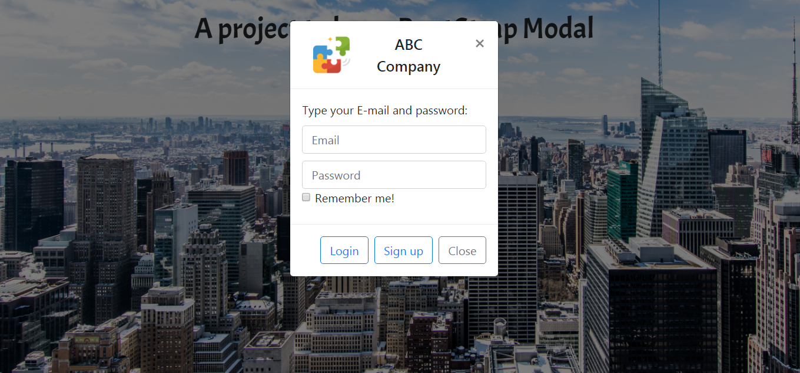
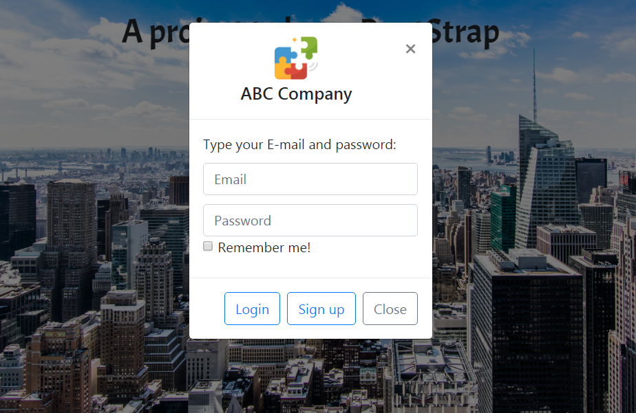

# BootStrap Login webpage
## 描述
### 參與Udemy上的線上課程**A complete Bootstrap 4 course for beginners. Master Bootstrap 4 basics with 3 projects**，利用BootStrap實作響應式(Responsive Web Design)網頁。

## 使用
+ HTML
+ CSS
+ BootStrap4 (Responsive Web Design)
+ Google Fonts

## 檢視
+ 登入畫面

+ 點選Login跳出Modal

+ 響應式網頁(在較小的頁面，Logo與公司名稱分兩行呈現)

## Demo
BootStrap Login webpage [Link](https://codepen.io/jialin128/full/pLNBMY/)